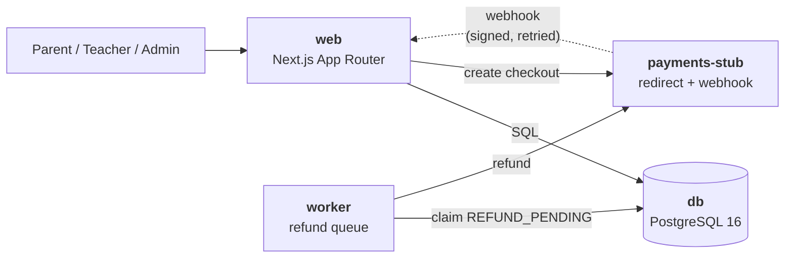

# Architecture

How the system is built. Scope lives in [`adr/0001-trial-class-booking-platform.md`](adr/0001-trial-class-booking-platform.md);
tables and columns live in [`erd.md`](erd.md).

---

## 1. Stack

| Concern | Choice | Why |
|---------|--------|-----|
| Application | Next.js, App Router | One deployable, one type system. Server Components query the database directly, removing a serialisation layer |
| Language | TypeScript, `strict` | Types flow from Prisma through to the UI |
| Styling | Tailwind CSS | Styling colocated with markup; no design language imposed |
| Database | PostgreSQL 16 | The capacity invariant is enforced by row locking and partial indexes |
| Data access | Prisma | Generated types, migration history as schema documentation, transaction API |
| Auth | Auth.js, credentials provider | Works offline; supplies CSRF protection and cookie handling we would otherwise hand-roll |
| Payments | `PaymentProvider` port, stub adapter | Reproduces redirect + async webhook shape without a network |
| Runtime | Docker Compose | Single command, offline, reproducible |

**Why not a separate SPA and API.** Two deployables, duplicated types, and CORS plumbing, buying
independent scaling we do not need.

**Why not hosted auth or a real gateway.** Both break the offline requirement, which is a hard
constraint on the MVP.

**Why not SQLite.** It would remove a container, but its write-locking model is not representative
of the concurrency this system exists to get right.

---

## 2. Containers



Four containers. `docker compose up` starts them, applies migrations, and seeds demo data —
classes with seats, a parent, a teacher, and an admin — so the app is explorable immediately.

The **stub payment provider** exists because the shape of the integration is what the design has to
survive: a webhook that arrives late, twice, or not at all. The stub can force success, failure,
delay, and duplicate delivery, which is harder to trigger against a real sandbox. It must never ship
in a production image.

---

## 3. Layout

```
app/
  (public)/                 catalogue, class detail, sign in, register
  (parent)/                 students, bookings, checkout return
  (teacher)/                own classes, own rosters
  (admin)/                  all classes, payments, users
  api/webhooks/payment/     signature verify, compare-and-swap, allocate
  actions/                  Server Actions: validate, authorise, delegate
lib/
  services/                 booking.ts, allocation.ts, refund.ts, class.ts, student.ts
  payments/                 PaymentProvider port + stub adapter
  authz.ts                  role and ownership checks
  db.ts                     Prisma client singleton
  auth.ts                   Auth.js configuration
  validation/               Zod schemas shared by actions and services
worker/
  index.ts                  refund queue loop
prisma/
  schema.prisma, migrations/, seed.ts
```

**Layering rule.** Dependencies point inward: `app/` and `worker/` may import from `lib/`, never the
reverse. A file in `lib/services/` importing from `next/*` is a defect. This is what lets the web
process and the worker share one implementation of the refund rules.

**Service contract.** Services are plain functions taking a Prisma transaction client and validated
input. No framework imports, no request context. The allocation logic can therefore be tested by
calling it directly against a real database, with no HTTP layer to stand up.

**Server Actions are thin adapters** — parse with Zod, resolve the session, check role and
ownership, call the service, map the result.

---

## 4. Concurrency

Three guards. Each one lets PostgreSQL arbitrate instead of the application, so none depends on a
background job or on remembering to write a check.

### 4.1 Seat allocation — `SKIP LOCKED`

```sql
UPDATE seats SET booking_id = $1
WHERE id = (SELECT id FROM seats
            WHERE trial_class_id = $2 AND booking_id IS NULL
            FOR UPDATE SKIP LOCKED
            LIMIT 1)
RETURNING id;
```

Zero rows means the class is full, which is the refund branch. Concurrent claimers skip past rows
other transactions are holding and take the next free one, so they fan out across the four seats
instead of colliding.

Measured with eight simultaneous payments against a four-seat class: four confirmed, four refunded,
**zero retries and zero errors.**

> **Why not count the confirmed bookings?** PostgreSQL's default isolation is `READ COMMITTED`, under
> which two transactions can both run `SELECT count(*)`, both see 3, and both insert. Both are fully
> atomic and both commit. **Atomicity is not the property that helps here** — isolation is, and the
> default level permits exactly this. Verified on PostgreSQL 16 defaults: naive count-then-insert
> produced 5 confirmed bookings in a 4-seat class. A count check is *advisory only*.
>
> **Why not a `FOR UPDATE` lock on the class row?** Correct, and one line, but the guarantee is opt-in
> per code path — it protects only callers who remember to write it.
>
> **Why not a `seat_number` column with a unique index?** Also correct, but you cannot lock a row that
> does not exist, so two claimers pick the same number and one fails with `23505` after the fact. That
> needs a retry loop, and it *blocks* — PostgreSQL waits for the conflicting transaction to commit
> before raising the error. Materialised rows can be locked, so `SKIP LOCKED` avoids both.
>
> **Why not a reconciliation job** that lets payments through and periodically refunds everyone past
> the fourth? It widens the race window from one statement to the job interval, multiplying the number
> of parents charged and then refunded; it makes a wrong roster publicly visible meanwhile; and it makes
> correctness depend on a background job that can silently stop. **Do not add one back.**

### 4.2 Duplicate bookings — partial unique index

```sql
CREATE UNIQUE INDEX one_live_booking_per_student ON bookings (trial_class_id, student_id)
  WHERE status IN ('PENDING_PAYMENT', 'CONFIRMED');
```

A second booking for the same child raises `23505`. **The application catches it and returns the
existing booking**, which makes a spammed button naturally idempotent and makes an abandoned
checkout resumable.

### 4.3 Webhook replay — compare-and-swap

```sql
UPDATE payment_attempts SET status = 'SUCCEEDED', updated_at = now()
WHERE provider_ref = $1 AND status = 'INITIATED'
RETURNING booking_id;
```

Zero rows means another delivery already processed it — return `200` and stop. Providers retry
webhooks on any timeout, so duplicate delivery is normal traffic. Two handlers racing on the same
reference serialise on that row and exactly one proceeds.

This matters more than ordinary idempotency: the webhook is what *allocates seats*, so an
undeduplicated replay would confirm twice and consume two seats.

---

## 5. Request flows

### 5.1 Booking

1. Advisory availability check. Refuse to start checkout if the class is already full — this does
   not close the race, but it stops the obviously doomed payments before money moves.
2. Insert the booking as `PENDING_PAYMENT`. On `23505`, return the existing booking (§4.2).
3. Create a checkout session through the `PaymentProvider` port, refusing unless the booking is
   `PENDING_PAYMENT`.
4. Insert a `payment_attempts` row as `INITIATED` with the provider's reference.
5. Redirect the parent to the provider.

Nothing is reserved by any of this.

### 5.2 Payment webhook

Verify the signature, then compare-and-swap the attempt (§4.3), then branch on the booking's state
— all in one transaction:

| Booking state | Outcome |
|---------------|---------|
| `PENDING_PAYMENT`, seat claimed | `CONFIRMED`, `confirmed_at` stamped, attempt `SUCCEEDED` |
| `PENDING_PAYMENT`, no seat free | `CANCELLED` + attempt `REFUND_PENDING` (`CLASS_FULL`) |
| anything else | booking untouched + attempt `REFUND_PENDING` (`DUPLICATE_PAYMENT`) |

The third row is what makes double payment survivable. A parent who double-clicks "Pay" or retries
after a dropped connection can produce two successful charges; that branch funnels the second to a
refund rather than an error or a silent overwrite.

No slow work belongs in this transaction. Refunds are queued, never called inline.

### 5.3 Cancellation

Set the booking `CANCELLED`, stamp `cancelled_at`, set `seats.booking_id = NULL`, and queue the
refund with `PARENT_CANCELLED`.

**This needs no coordination.** Emptying the seat returns the row to the free pool, which the next
`SKIP LOCKED` claim picks up. There is no counter to decrement and nothing to race with — the
mechanism that enforces capacity releases seats as a side effect.

A teacher or admin cancelling a class does the same for every confirmed booking, with
`CLASS_CANCELLED`.

### 5.4 Refund worker

Poll for `REFUND_PENDING` attempts, claiming rows with `SELECT ... FOR UPDATE SKIP LOCKED` so
multiple copies are safe. Call the provider's refund API. Move to `REFUNDED`, or `REFUND_FAILED`
with a retry count and backoff.

Refunds are automatic because losing the race is an ordinary outcome, not an exception — leaving
them to an admin queue would bury staff under routine work the design generates by intent. A failed
refund becomes a visible database state rather than a lost side effect, and admins can retry it.

> **There is no reconciliation or audit job.** An overbooked class cannot occur (§4.1), and the only
> other invariant worth watching — a `CONFIRMED` booking holding no seat — is prevented by writing
> both changes in one transaction. A job guarding against a bug that transactions already prevent is
> speculative infrastructure. That invariant is asserted in tests instead, where it costs nothing.

---

## 6. Authorisation

Three roles, exactly one per user: `PARENT`, `TEACHER`, `ADMIN`. Classes are owned via
`trial_classes.teacher_id`.

Authorisation for class-scoped actions is **role plus ownership** — a teacher may act on their own
classes, an admin on any. This is the genuinely new burden compared with a flat role check, and it
must be applied to every class-scoped mutation and every roster read.

| Check | Rule |
|-------|------|
| Role | `session.user.role` matches what the action requires |
| Class ownership | `trial_classes.teacher_id = session.user.id`, or the user is an admin |
| Student ownership | The booking's student belongs to the session user — checking only the booking would let a parent act on someone else's child |

All three live in `lib/authz.ts` and are called **by the service**, not only by the route. Every
Server Action independently resolves the session and runs them. Middleware handles redirects for
unauthenticated navigation but is a UX affordance, never the enforcement point — a Server Action is
directly invocable and must defend itself.

---

## 7. Security

- **Passwords** are bcrypt-hashed at cost 12, never logged, never included in a query selection
  returned to the client.
- **Teacher data minimisation.** A teacher's roster returns student names and each student's parent
  name — nothing else. Contact details and all payment records are admin-only, and the query selects
  those columns explicitly rather than filtering a full record after loading it.
- **Webhook signatures** are verified before any processing, with a constant-time comparison. This
  endpoint has no user session, and under §4.1 it allocates seats and moves money, so an unverified
  webhook is a forged booking.
- **Amount verification.** The confirmed amount is checked against `trial_classes.price_cents` rather
  than trusted from the provider payload.
- **Input validation** uses Zod at the action boundary; services assert their own preconditions rather
  than trusting callers.
- **Injection** is avoided by Prisma's parameterised queries. Raw statements use bound parameters,
  never interpolation.
- **The capacity invariant is enforced below the application**, so it holds even for code paths that
  bypass the service layer. Dropping the `seats` unique constraint in a migration is a
  security-relevant change, not a schema tidy-up.
- **Rate limiting** applies to sign-in, registration, and checkout creation. The MVP uses a per-IP
  in-memory limiter, honest about its limitation: per-process, resets on restart. A shared store is
  required before running more than one web instance.
- **Enumeration.** Sign-in and registration return the same generic failure regardless of whether the
  email exists.
- **Seeded credentials** are development-only and documented as such in the README.

---

## 8. Testing

Effort concentrates where a bug costs money.

| Layer | Tool | Coverage |
|-------|------|----------|
| Allocation | Vitest + real Postgres | Claim, exhaustion, refund queueing |
| **Concurrency** | Vitest | N simultaneous confirmations against a 4-seat class → exactly 4 `CONFIRMED`, N−4 `CANCELLED` with `CLASS_FULL` refunds, and **zero retries** |
| Invariant | Vitest | Every `CONFIRMED` booking holds exactly one seat; every occupied seat points at a `CONFIRMED` booking |
| Constraint | Vitest | A direct `UPDATE` bypassing the service layer cannot put two bookings in one seat |
| Seat reuse | Vitest | Cancelling frees a seat the next confirmation claims |
| Idempotency | Vitest | Duplicate webhook delivery confirms once and consumes one seat |
| Double payment | Vitest | A second successful payment on a `CONFIRMED` booking refunds rather than reconfirming |
| Authorisation | Vitest | A teacher cannot read or mutate another teacher's class |
| Refund worker | Vitest | Retry on failure, `SKIP LOCKED` claiming, terminal states |

**The database is never mocked in service tests.** The invariant under test is enforced by PostgreSQL
row locking; a mock would satisfy every assertion while the real system overbooks. This is not
hypothetical — a naive count-then-insert was demonstrated producing 5 confirmed bookings in a 4-seat
class on default PostgreSQL 16 settings, and no mock would have caught it.

Tests run against a dedicated database, truncated between cases.

---

## 9. Configuration

| Variable | Purpose | Default in `.env.example` |
|----------|---------|---------------------------|
| `DATABASE_URL` | Postgres connection string | Compose service |
| `AUTH_SECRET` | JWT/cookie encryption key | Development value; must be replaced for real deployment |
| `AUTH_URL` | Canonical app URL | `http://localhost:3000` |
| `APP_TIMEZONE` | Display timezone | `Asia/Singapore` |
| `PAYMENT_PROVIDER` | Adapter selection | `stub` |
| `PAYMENT_STUB_URL` | Stub provider base URL | Compose service |
| `PAYMENT_WEBHOOK_SECRET` | Webhook signature key | Development value |
| `REFUND_POLL_INTERVAL_MS` | Worker refund loop interval | `5000` |
| `DEFAULT_CLASS_SEATS` | Seats materialised per new class | `4` |
| `SEED_ADMIN_EMAIL` / `SEED_ADMIN_PASSWORD` | Seeded admin account | Development values only |

All timestamps are stored as `timestamptz` in UTC and formatted at the edges in `APP_TIMEZONE`.
Staff datetime inputs are interpreted in that zone and converted on write, so every conversion is a
single testable step.

`.env` is git-ignored; only `.env.example` is committed, containing no real secret.
