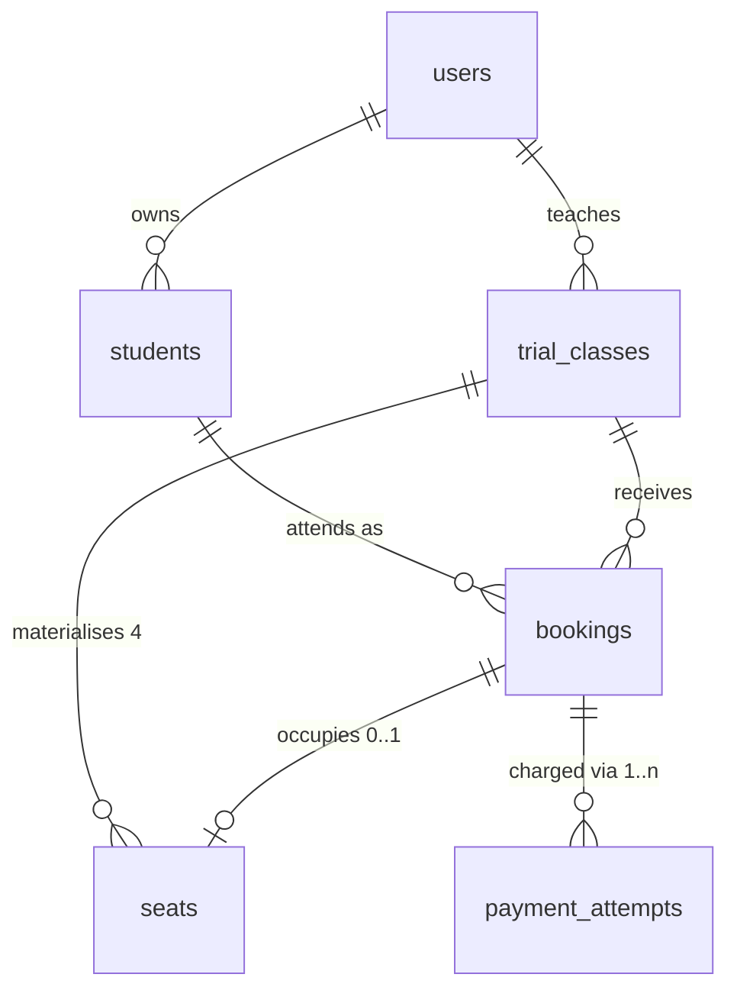
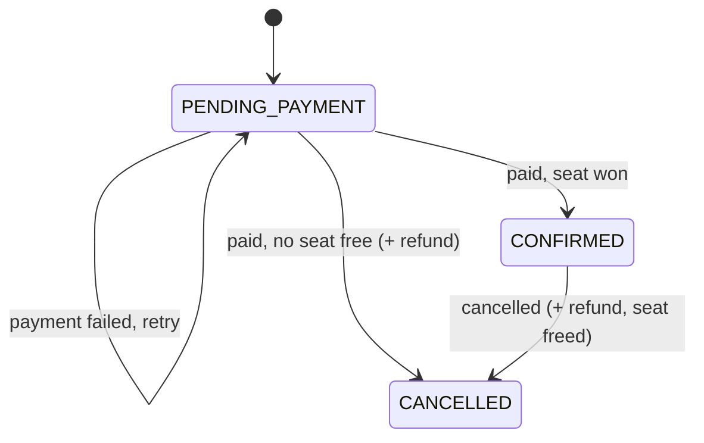

# Data Model

Six tables. Scope and product rules live in [`adr/0001-trial-class-booking-platform.md`](adr/0001-trial-class-booking-platform.md);
mechanisms and query patterns live in [`architecture.md`](architecture.md).

The single organising idea: **capacity is rows, not a number.** A class's four seats exist as
four `seats` rows. There is no capacity column, no seat counter, and no seat number.

---

## Relationships



The spine runs `trial_classes → seats → bookings → payment_attempts`. People hang off it:
`users` owns `students`, and `users` also teaches `trial_classes`.

**`seats` is current-state inventory. `bookings` is the permanent record.** A seat only ever
answers "is anyone sitting here right now", which is why emptying one on cancellation destroys
no history.

---

## `users`

Parents, teachers, and admins in one table.

| Column | Type | Notes |
|--------|------|-------|
| `id` | uuid PK | |
| `email` | citext, unique | Case-insensitive |
| `password_hash` | text | bcrypt, cost 12 |
| `name` | text | |
| `phone` | text, null | |
| `role` | enum `PARENT \| TEACHER \| ADMIN` | Exactly one role per user |
| `created_at` | timestamptz | |

Teacher and admin accounts are created by seed or by an admin. There is no staff
self-registration.

---

## `students`

| Column | Type | Notes |
|--------|------|-------|
| `id` | uuid PK | |
| `parent_id` | uuid FK → `users` | |
| `name` | text | |
| `date_of_birth` | date | **Age is derived, never stored** |
| `notes` | text, null | Allergies, accessibility needs |
| `created_at` | timestamptz | |

A stored age is wrong within a year of being written and every comparison against it silently
rots, so the date of birth is the stored fact.

Deleting a student must be a soft delete or be blocked while bookings reference them — roster
history must not lose the attendee's name.

---

## `trial_classes`

A single dated session.

| Column | Type | Notes |
|--------|------|-------|
| `id` | uuid PK | |
| `teacher_id` | uuid FK → `users` | Owner of the class |
| `title` | text | |
| `slug` | text, unique | Public URL |
| `description` | text | |
| `starts_at` | timestamptz | UTC |
| `ends_at` | timestamptz | UTC |
| `price_cents` | int, check `>= 0` | |
| `currency` | char(3) | `SGD` |
| `location` | text | |
| `age_min` | int, null | Advisory only |
| `age_max` | int, null | Advisory only |
| `status` | enum `SCHEDULED \| CANCELLED` | |
| `created_at` | timestamptz | |

**No `capacity` column.** Capacity is the number of `seats` rows. A stored number alongside the
rows would be a second source of truth that can drift.

**No `category` column.** Deliberately omitted.

---

## `seats`

The capacity mechanism. Four rows are created with the class, in the same transaction, and live
as long as it does.

| Column | Type | Notes |
|--------|------|-------|
| `id` | uuid PK | |
| `trial_class_id` | uuid FK → `trial_classes`, on delete cascade | |
| `booking_id` | uuid FK → `bookings`, **unique**, null | `NULL` means free |

```sql
CREATE INDEX seats_free ON seats (trial_class_id) WHERE booking_id IS NULL;
```

`booking_id UNIQUE` permits many `NULL`s in PostgreSQL, so every free seat coexists happily under
the constraint while no booking can ever hold two seats.

**No `seat_number`.** It was never what capped the class — the row count is. Dropping it removes an
`ORDER BY` from the claim query and a `CHECK` constraint that pinned capacity at 4.

**No `student_id`.** Adding one with `UNIQUE (trial_class_id, student_id)` would be either broken or
redundant: leave it set on cancellation and that student can never rebook the class; clear it and the
constraint does nothing that `one_live_booking_per_student` doesn't already do.

**Lifecycle**

| Event | Effect on seats |
|-------|-----------------|
| Class created | Insert `DEFAULT_CLASS_SEATS` rows, same transaction as the class |
| Payment confirmed | One free row claimed, `booking_id` set |
| Booking cancelled | `booking_id = NULL`, immediately reclaimable |
| Capacity increased | Insert rows |
| Capacity decreased | Delete free rows only; refuse if it would strand a confirmed booking |
| Class deleted | Cascade |

---

## `bookings`

The historical record.

| Column | Type | Notes |
|--------|------|-------|
| `id` | uuid PK | |
| `trial_class_id` | uuid FK → `trial_classes` | |
| `student_id` | uuid FK → `students` | The parent resolves through the student |
| `status` | enum `PENDING_PAYMENT \| CONFIRMED \| CANCELLED` | |
| `created_at` | timestamptz | |
| `confirmed_at` | timestamptz, null | |
| `cancelled_at` | timestamptz, null | |

**No `parent_id` column.** The parent is `booking → student → parent`. Storing it here would let a
booking claim one parent while its student claims another.

### Status lifecycle

| Status | Holds a seat | Meaning |
|--------|--------------|---------|
| `PENDING_PAYMENT` | No | Intent recorded, checkout not yet succeeded. **Resumable** |
| `CONFIRMED` | **Yes** | Payment succeeded and a seat was claimed |
| `CANCELLED` | No | Not happening |



Three statuses only. **The reason a booking ended lives in `payment_attempts.refund_reason`**, not
in the status — `CLASS_FULL` means they lost the race, `PARENT_CANCELLED` means they withdrew,
`CLASS_CANCELLED` means the school did. Parent-facing copy derives from that reason.

A booking that never completed checkout is simply one sitting at `PENDING_PAYMENT` with no
successful attempt. There is no `ABANDONED` state and no sweeper, because such a booking is
**resumable** — the parent returns to it and pays.

### Constraints

```sql
CREATE UNIQUE INDEX one_live_booking_per_student ON bookings (trial_class_id, student_id)
  WHERE status IN ('PENDING_PAYMENT', 'CONFIRMED');
```

One live booking per student per class. A student may rebook after a cancellation, since
`CANCELLED` sits outside the index.

The constraint is on `student_id`, **not** the parent: a parent with several children may book all
of them into the same class, up to and including filling it.

---

## `payment_attempts`

Plural by design — a booking may be paid for across several attempts, and the history is both an
audit trail and the retry record.

| Column | Type | Notes |
|--------|------|-------|
| `id` | uuid PK | |
| `booking_id` | uuid FK → `bookings` | 1..n per booking |
| `provider` | text | `stub` in the MVP |
| `provider_ref` | text, **unique** | Idempotency key for webhook replay |
| `amount_cents` | int | Verified against the class price on confirmation |
| `currency` | char(3) | |
| `status` | enum, see below | |
| `refund_reason` | enum, null | |
| `failure_reason` | text, null | |
| `raw_payload` | jsonb, null | Last provider payload, for debugging |
| `created_at` | timestamptz | |
| `updated_at` | timestamptz | |

**`status`** — `INITIATED | SUCCEEDED | FAILED | REFUND_PENDING | REFUNDED | REFUND_FAILED`

**`refund_reason`** — `CLASS_FULL | DUPLICATE_PAYMENT | PARENT_CANCELLED | CLASS_CANCELLED`

```sql
CREATE INDEX refunds_due ON payment_attempts (created_at) WHERE status = 'REFUND_PENDING';
```

`provider_ref` being unique is what makes webhook replay safe. Deduplicating on `booking_id` would
be wrong, because a booking legitimately has several attempts after a failed payment.

---

## Derived values

Nothing about capacity is stored as a number.

| Value | Expression |
|-------|------------|
| `seats_remaining` | `count(seats WHERE trial_class_id = ? AND booking_id IS NULL)` |
| `capacity` | `count(seats WHERE trial_class_id = ?)` |
| a student's age | `age(students.date_of_birth)` at read time |
| a booking's parent | `booking → student → parent_id` |
| whether a booking is paid | a `SUCCEEDED` attempt exists for it |

`seats_remaining` is exact rather than an estimate, because the seats *are* the capacity. It drives
display and the advisory pre-check at booking time; the guarantee itself comes from the claim query
in [`architecture.md`](architecture.md).

---

## Known seam

A `seats` row and the booking occupying it each carry a `trial_class_id`, so they could in principle
disagree. A composite foreign key would close this, at the cost of a redundant unique index on
`bookings (id, trial_class_id)`.

Left to the service layer for now, since both writes happen in one transaction from one code path.
This is the last unguarded seam in the model.
